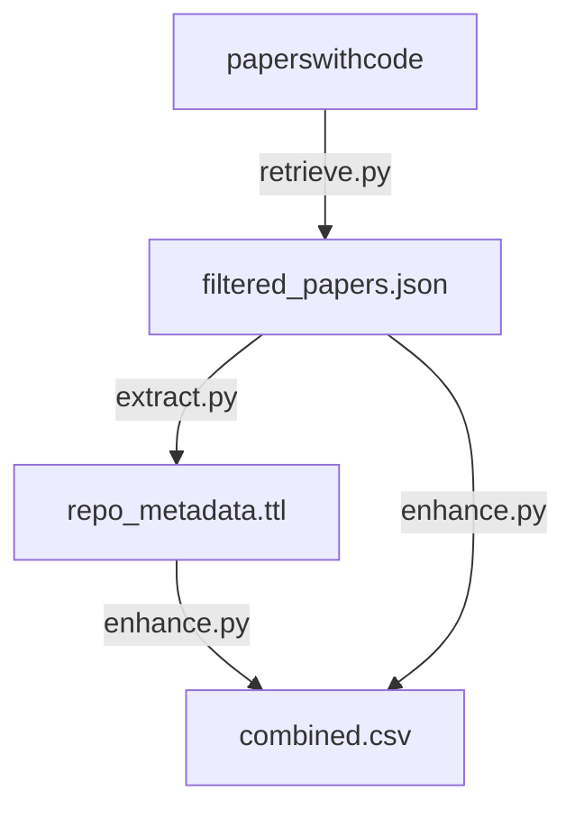

# License collector

Automatically collect license and other metadata from open-source data science repositories.

## Workflow

The repository contains a Prefect workflow which downloads a list of open source repositories from paperswithcode (see [links between papers and code](https://paperswithcode.com/about)) and runs [gimie](https://github.com/SDSC-ORD/gimie) on each git repository. The extracted metadata from all repositories are then combined into a single RDF graph. A table is also extracted from this graph to provide specific attributes.

The input dataset contains links to ~200k github repositories. It is provided by paperswithcode under the [CC-BY-SA](https://creativecommons.org/licenses/by-sa/4.0/) license ([download link](https://production-media.paperswithcode.com/about/links-between-papers-and-code.json.gz)).

The repository is composed of 3 workflows:

* [`retrieve.py`](src/retrieve.py): Download paperswithcode dataset and filter papers with github/gitlab repositories.
* [`extract.py`](src/extract.py): Run gimie on each repository and extract RDF metadata using the GitLab / GitHub API.
* [`enhance.py`](src/enhance.py): Combine original paperswithcode dataset with repository metadata for visualization.

> ⚠️ You will need to provide your own GitLab / GitHub API tokens as environment variables `GITHUB_TOKEN` and `GITLAB_TOKEN`.


For convenience, [`main.py`](src/main.py) script composes the above steps into a higher level workflow, which can be run with a single command:

Workflow configuration is defined in [`config.py`](src/config.py).

```bash
make pipeline
```

## Quick Start
### Set up the environment
1. Install [Poetry](https://python-poetry.org/docs/#installation)
2. Set up the environment:
```bash
make setup
make activate
```
### Install new packages
To install new PyPI packages, run:
```bash
poetry add <package-name>
```

### Run Python scripts
To run the Python scripts type the following:
```bash
make pipeline
```

